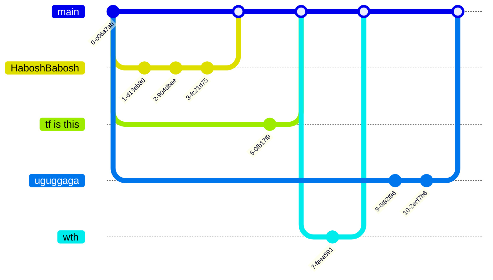

# Mana and Artifice addon "Hold it!"

## About "Hold it"
Our addon is a modification for "Mana and Artifice". Addon adds chargeable spells. 
Link to DEMO video - https://www.youtube.com/watch?v=ozBsxAzulP0
# Body
## Project goals and description
Our goal is to create various chargeable spell shapes that original mod does not have and show how powerful chargeable 
magic is. 
### Description
Our addon has 8 different spell shapes that players can obtain during their gameplay.
Our spell shapes have different modifiers that players can use to make them more or less powerful. All components of 
"Mana and Artifice" mod can be applied to our spell shapes.
## Feature Roadmap
In future we are planning to add more spell shapes and probably a structure where players can find our spells.
## Usage instructions and installation
To use our addon firstly you should have 1.20.1 minecraft neoForge version downloaded 
secondly you should have 1.20.1 "Mana and artifice" mod downloaded and be in .minecraft/mods folder,
and after you have all of that you simply need to download addon from curseforge 
and drop it into .minecraft/mods folder. P.S to access .minecraft/mods folder you should click win + r combination
then write  %appdata% and here you will find .minecraft folder.
## Link to Mana and Artifice “(for customer)”
This project is addon to it, you should definitely first check it out
https://www.curseforge.com/minecraft/mc-mods/mana-and-artifice?page=1
## Public access “(for customer)”
We are more than summer project
https://www.curseforge.com/minecraft/mc-mods/hold-it

# Hyperlinks and etc.
## Development
### Kanban board 
link - https://app.weeek.net/ws/822843/shared/board/0EKi1Fon4zzTeWl31cqlKp85NG6mgyAT
criteria: 
To do - what is planned, but yet, still in queue
In progress - being developed
In review - main development ended, looking for possibility of minor fixing
Ready to deploy - basically done, but still needs to be tested
User testing - looking for a possible feedback
Done - done
### Git workflow
Work is divided to spells. Part of team works on interface, part on logic and behaviour. Icons are considered as interface and mostly being made there. Labels are set to match how many story points each issue provides. We consider each spell as standalone roject, so SP can overlap.  

### Secrets management
Token for entering project is in private messages!!!(and shown as spoiler 0_0)

## Quality assurance

### Self-descriptiveness
Our product is based on charging logic, which is even said in name "Hold it!"

### Inclusivity and User assistance
Our product implemented in minecraft, and anyone can play it
